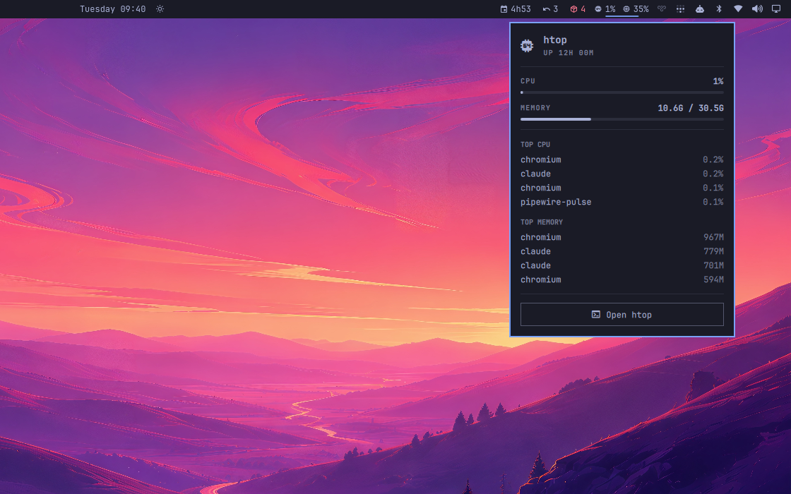

# htop for Omarchy

Live CPU and memory in the bar. Click it for the panel that answers what is
eating this machine right now, and a button that opens the real htop in a
terminal window.



*The meters in the bar, and the panel that opens from them.*


The catalogue has four native process monitors and two plugins that launch
btop. This is the one that fronts htop, and it does not reimplement it.

## Install

```bash
omarchy plugin add https://github.com/fernandomenolli/omarchy-htop.git --enable
```

Needs `htop` and Omarchy 4.

## Remove

```bash
omarchy plugin remove io.github.fernandomenolli.htop
```

That takes the plugin out of the bar and deletes its directory. Your htop
config is left behind on purpose. Delete it yourself if you want it gone:

```bash
rm -rf ~/.local/state/omarchy/plugins/io.github.fernandomenolli.htop
```

The plugin writes nowhere else. Your `hyprland.conf`, `shell.json` and
`~/.config/htop/` are never touched.

## What the clicks do


*CPU and memory, left of the tray.*

| Click | Action |
|-------|--------|
| left | open the panel |
| right | cycle what the bar shows: both → CPU → memory |

Inside the panel, **Open htop** opens htop in a terminal window. It is an
ordinary Hyprland window you tile, move and close like any other. Press it again with
htop already running and it focuses that window instead of opening a second
one.

## Bind it to a key

The plugin never writes to your Hyprland config. If you want htop on a key,
add it yourself:

```lua
-- ~/.config/hypr/bindings/htop.lua
o.bind("SUPER + ESCAPE", "System monitor", "omarchy-shell io.github.fernandomenolli.htop toggle")
```

## Settings

Omarchy has no settings screen yet, so a setting is a key on this widget's own
entry in the bar layout of `~/.config/omarchy/shell.json`:

```json
{
  "id": "io.github.fernandomenolli.htop",
  "intervalMs": 3000
}
```

The panel has a button that opens that file in your editor.

| Setting | Default | What it does |
|---------|---------|--------------|
| Refresh interval | 2000 ms | how often the meters resample |
| Show in the bar | both | both, CPU only, or memory only |
| Urgent above | 85% | where a meter turns the theme's urgent colour |
| Rows per process list | 4 | length of the two lists in the panel |

## What it costs

Measured on the machine this was built on, an AMD box with 24 cores running
Omarchy 4.0.0.alpha and Hyprland 0.56.2. The method is to read `utime + stime`
from `/proc/<pid>/stat` for the `omarchy-shell` process, with the plugin
enabled and then disabled, and take the difference. You can repeat it in four
lines of shell.

| | Shell alone | With this plugin |
|---|---|---|
| Idle, 30 seconds | 10 ms of CPU | 30 ms, the only one of these that ticks at rest |
| 300 focus switches | 840 ms | 890 ms |
| Memory | ~500 MB | no measurable change |

The shell's own cost dominates everything here. **2.8 ms of that per focus
switch is Omarchy itself**: the bar redrawing, the active-window widget, the
workspace indicators. All five of these plugins together add 0.17 ms on top.

**It does not get heavier as it runs.** The two `/proc` reads cost the same on the first tick and the ten-thousandth; there is nothing accumulated to re-read.


## Your htoprc is yours

On first open the plugin seeds a curated `htoprc`, with two 50/50 columns,
kernel threads hidden and sorted by CPU, to:

```
~/.local/state/omarchy/plugins/io.github.fernandomenolli.htop/htoprc
```

htop rewrites that file when it exits, and the plugin never overwrites it
once it exists. Your `~/.config/htop/htoprc` is left alone either way.

Colours come from the terminal, which Omarchy themes, so htop follows a theme
switch on its own.

## Tests

```bash
node tests/run.js
```

No dependencies and no framework. They cover `model/`, which is the `/proc`
parsing and the formatting: the half that runs without a QML engine.

## Licence

MIT.
